# AYANEO RGB Control

**A free app to control the RGB joystick lights on the AYANEO Pocket Air Mini.** Change the stick LED colour, choose from 52 lighting effects and 48 themes, or make the lights react to music, button presses, battery level or temperature. It's an unofficial alternative to the RGB settings in AYASpace. No root needed.

> **Unofficial.** AYANEO RGB Control is a fan-made app. It is not made by, endorsed by or affiliated with AYANEO.

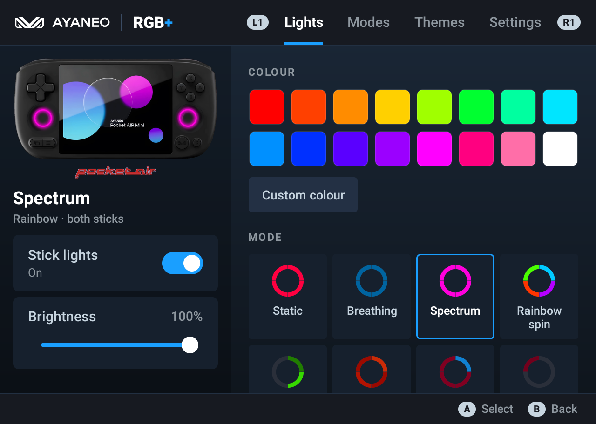

## Download

**[⬇ Download AYANEO-RGB-Control.apk (latest)](https://github.com/intelarc/ayaneo-rgb-control/releases/latest/download/AYANEO-RGB-Control.apk)** · [All releases](https://github.com/intelarc/ayaneo-rgb-control/releases)

## Install on the AYANEO Pocket Air Mini

1. Open the download link above in the device's browser and download the APK.
2. Open the downloaded file. If Android asks, allow your browser (or file manager) to **install unknown apps**, then go back and tap **Install**.
3. Open **AYANEO RGB Control**.
4. In **AYASpace**, turn its own RGB lighting off so the two apps don't fight over the LEDs.
5. Optional but recommended: **Settings → Calibrate**. It lights each LED in turn and asks where it is, so spins and per-LED colours land exactly right on your unit.

From a PC instead, with USB debugging on:

```
adb install AYANEO-RGB-Control.apk
```

To update, install the new APK over the old one. Your settings are kept.

## Features

- **52 joystick light effects** in six groups:
  - **Basic:** static colour, per-LED colours, breathing, pulse, flash, strobe, colour cycle.
  - **Rainbow:** spectrum, rainbow spin, rainbow wave, rainbow flash.
  - **Motion:** comet, marquee, scanner (Knight Rider), ping-pong, twist, radar, colour wave.
  - **Nature:** fire, candle, lava, ocean, aurora, sunset, forest, starry night, rain, lightning.
  - **Party:** police, disco, confetti, Christmas, matrix, synthwave.
  - **Smart:** battery level, temperature, music, reactive.
- **48 RGB themes** grouped as Gaming, Chill, Nature, Party, Seasonal and Smart. You can also save your own looks.
- **Easy colours:** 16 one-tap swatches plus a colour wheel with brightness and recent colours. Push the left stick to pick a colour without touching the screen.
- **Per-effect controls:** speed, brightness, amount, reverse, up to six palette colours, and each of the four LEDs on each stick on or off with its own colour.
- **Both sticks together.** Optionally mirror the right stick, or join both sticks into one ring so spins and comets travel from one stick to the other.
- **Live preview:** a photo of the device shows the current effect on its joystick rings, always in view.
- **Made for the controller,** in a Steam Deck style: L1 / R1 switch tabs, A selects, B goes back, and every control can be reached with the D-pad.
- **Runs in the background** and can restore your lights after a restart.

## Smart modes

| Mode | What it does | What it needs |
|---|---|---|
| **Music** | The sticks pulse to the bass and treble of whatever is playing. | Sound access (microphone permission) to measure how loud the sound playing on the device is. Nothing is recorded or stored. |
| **Reactive** | The sticks flash when you press buttons. | Turn on *RGB Control – reactive lights* in Android's Accessibility settings. It only notices button presses; it never blocks or changes them. The D-pad isn't detected on this unit. |
| **Battery** | The 8 LEDs fill up like a gauge, red when low and green when full. The top LED breathes while charging. | Nothing. |
| **Temperature** | Blue when cool (about 30 °C), red when hot (about 50 °C), and it pulses faster as the battery heats up. | Nothing. |

## FAQ

**How do I change the joystick light colour on the AYANEO Pocket Air Mini?**
Install AYANEO RGB Control, open the **Lights** tab and tap a colour, or use **Custom colour** for any shade. Turn off AYASpace's RGB setting first so it doesn't override the app.

**How do I turn the joystick lights off?**
Switch off **Stick lights** in the panel on the left of the app.

**Does it need root or ADB?**
No. It uses the firmware's own LED service (`custom_function`), the same one AYASpace uses. It doesn't change any system settings.

**Does it drain the battery?**
Barely. With an animated effect running in the background it uses about 1–1.5 % CPU and about 61 MB of memory. Static colours wake up only once every 15 seconds. **Settings → Animation** sets the update rate to 12, 24 or 30 per second.

**Will it work on other AYANEO handhelds (Pocket Air, Pocket DMG, Pocket S, Pocket Micro…)?**
It's only tested on the **Pocket Air Mini**. Other AYANEO Android devices that have the same LED service may work. If you try one, please [open an issue](https://github.com/intelarc/ayaneo-rgb-control/issues) and say how it went.

**Is the brightness the same as AYASpace?**
Yes. 100 % in this app matches the brightest setting AYASpace uses.

## Screenshots

| | |
|---|---|
|  | 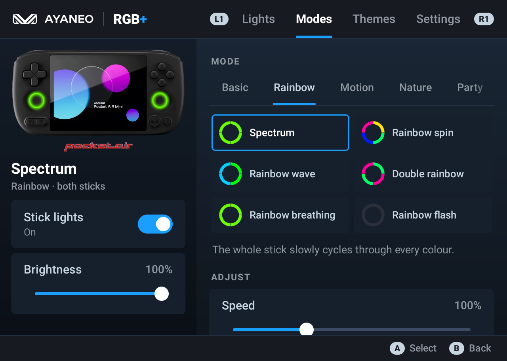 |
| 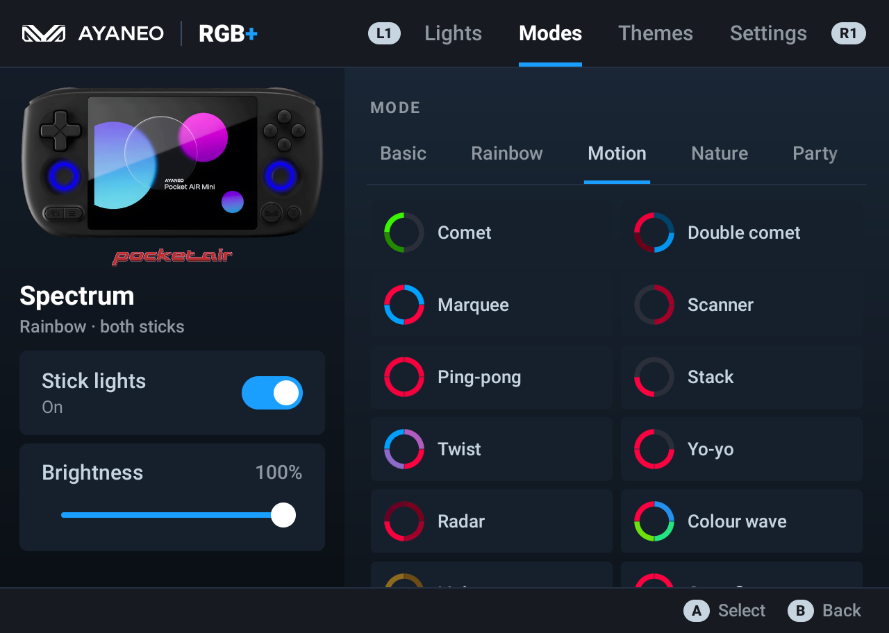 | 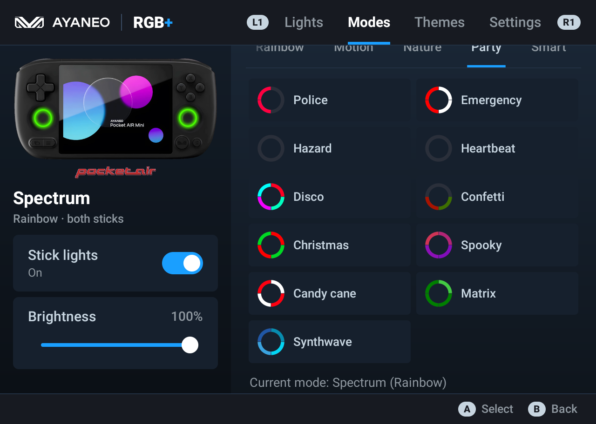 |
| 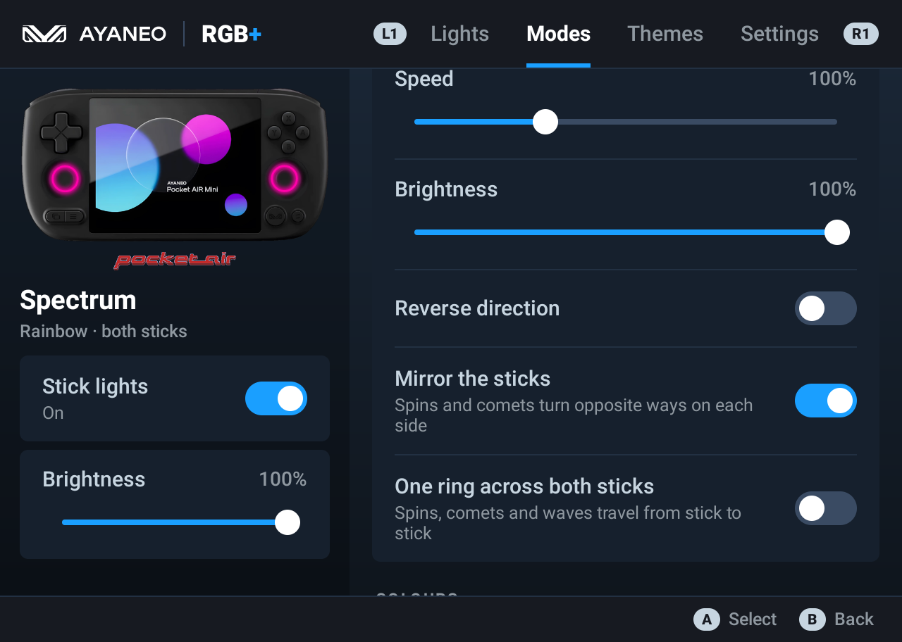 | 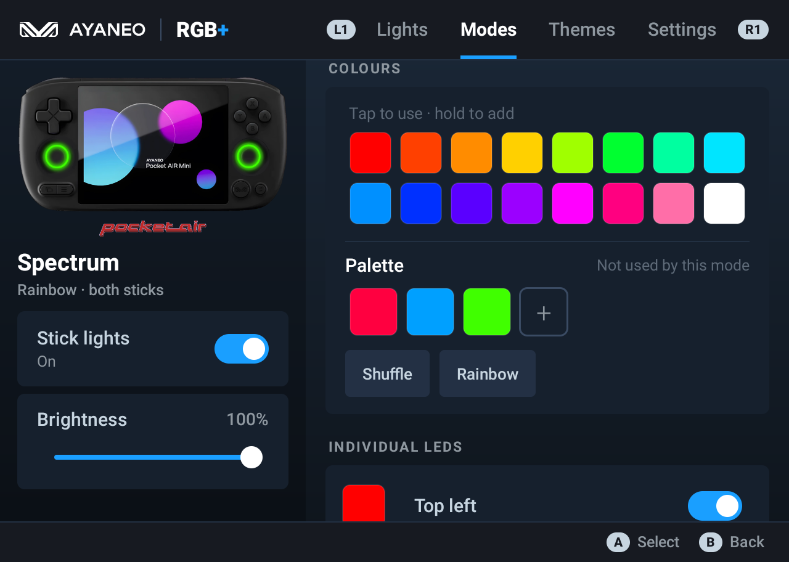 |
| 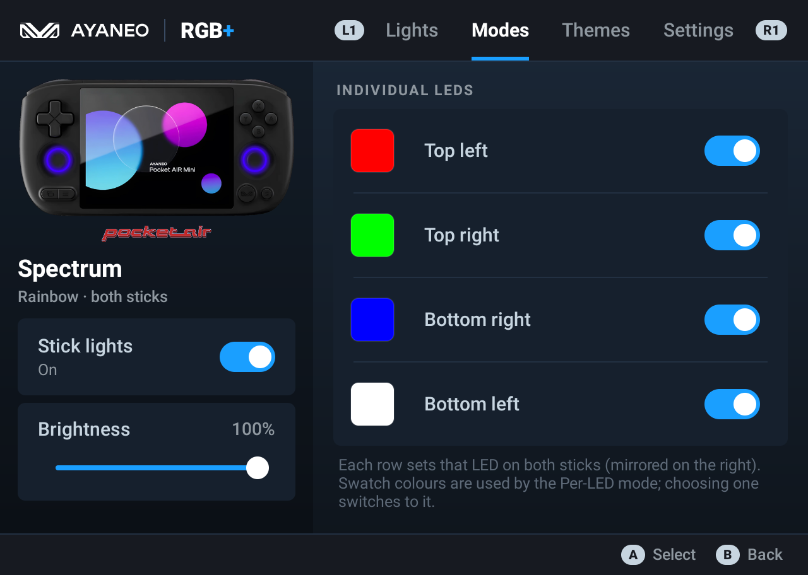 | 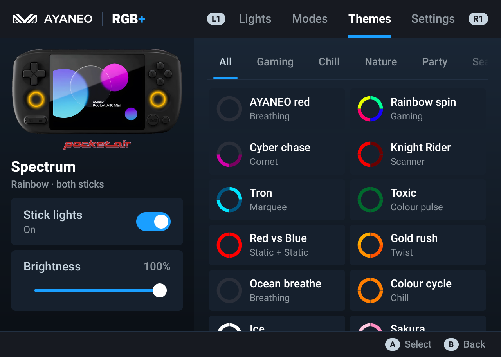 |
| 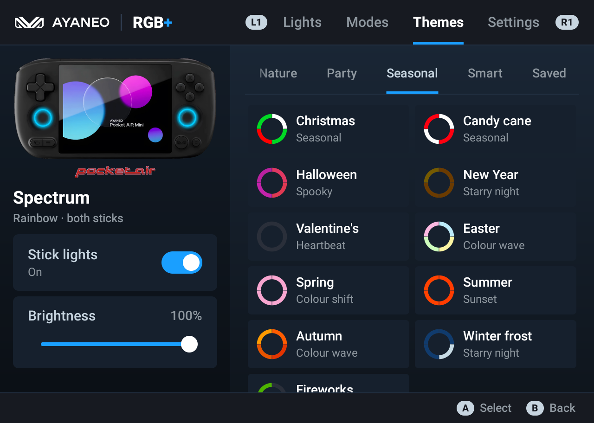 | 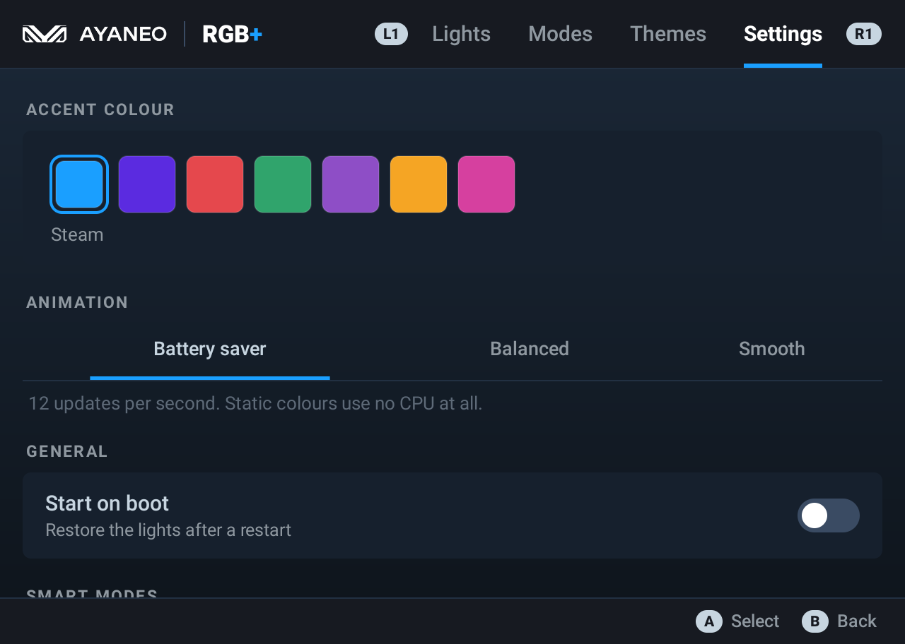 |
| 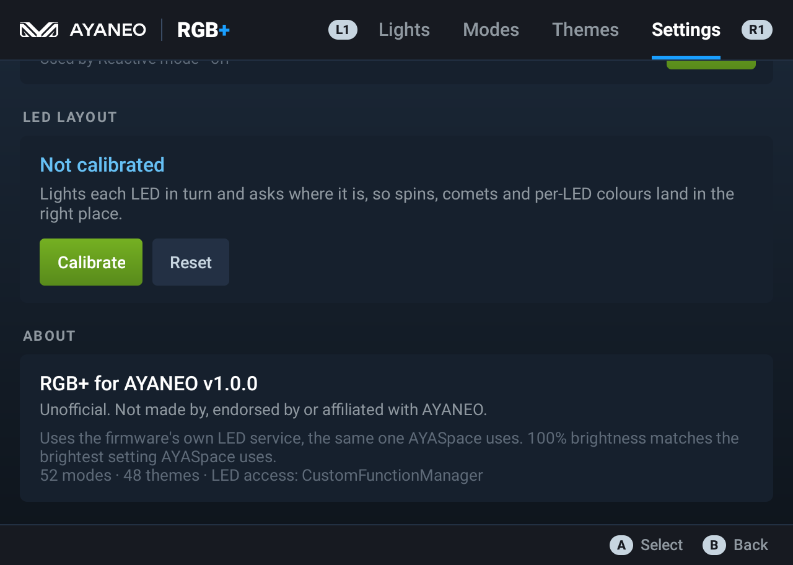 | 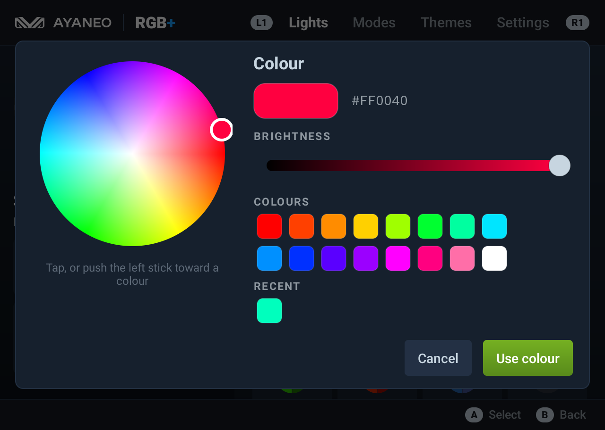 |
| 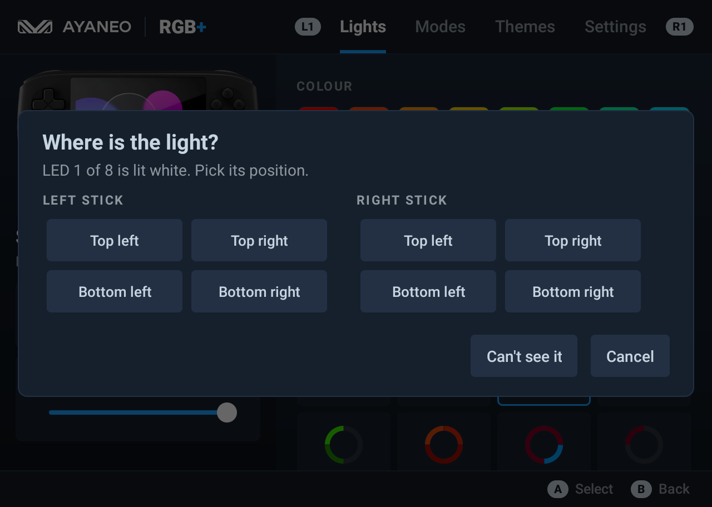 | |

## Build from source

You need JDK 17 or newer and the Android SDK (platform 37).

```
./gradlew assembleDebug
```

The APK lands in `app/build/outputs/apk/debug/`. A signed release build needs a `keystore.properties` file and a keystore, which aren't included in this repo.

## Related

- **[AYANEO Quick Menu](https://github.com/intelarc/ayaneo-quick-menu)**: a Steam Deck-style quick menu for the same handheld with performance modes, fan control, controller settings, quick toggles and an FPS overlay, from the same author. It shares this app's look and links back to it.

## Disclaimer

AYANEO, Pocket Air and their logos are trademarks of AYANEO. They're used here only to identify the hardware this app is for. The product photo is AYANEO's. This app is provided as is, with no warranty.

## License

The code is under the [MIT](LICENSE) license.
